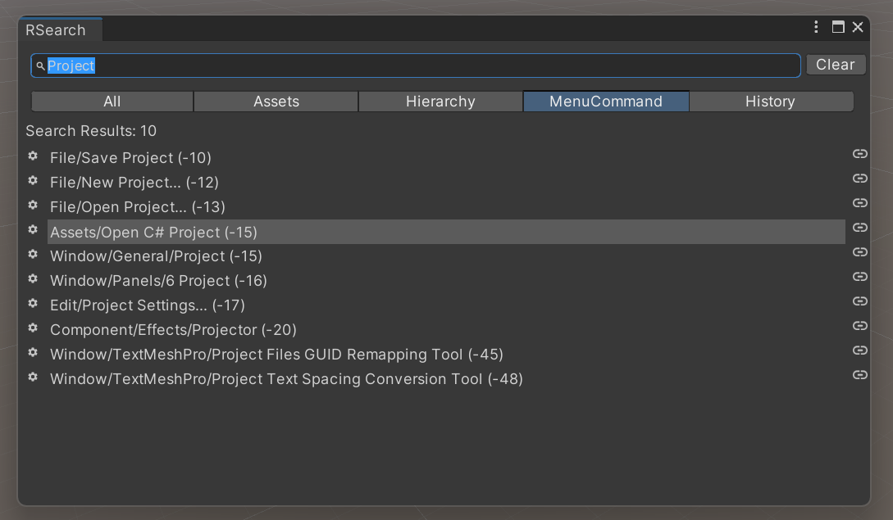

# TSearch - Unity Quick Search Package

TSearchは、Unityエディタ上でCmd (またはCtrl) + T ショートカットキーを使用して、
Assets, メニューコマンド, GameObjects, 検索履歴を高速に検索できるコマンドパレット機能を追加するパッケージです。




## 主な機能

- Assetsの高速検索
- Editor Commandsの高速検索
- Hierarchy内のGameObjectsの高速検索
- 検索履歴の管理

### Unity Search との違い

- ほぼディレイのない高速な検索
- 曖昧な検索をサポート
  - ellen.prefab を検索したい場合、elen と入力しても検索に表示
  - 部分列検索をサポートしているため、TimeMachineClip.cs のようなアセットも timeclip と入力して検索可能。
- 優先度付けにより、必要なアセットを上位に表示
  - 文字数が近い検索結果を優先するため、例えば an.prefab のような短いファイル名も一発で表示。
- 検索履歴の管理
  - 特定のアセット間をいったりきたりする場合に活用できる
- メニューコマンドも検索可能
  - 「あのメニューどこだっけ？」がなくなる。
  - Project Settings や PackageManager を開くのもコマンドで一発。
- 決定後のアクションがそのファイルを開く
  - cs ファイルであれば、 Editor でそのファイルを開く。
  - prefab であれば、その prefab の編集画面に入る。
  - マウス操作一切なしでファイルを開くことができる。

## インストール方法

### PackageManagerを使用したインストール

1. Unityプロジェクトの`Packages/manifest.json`ファイルを開きます。
2. 以下のように依存関係にTSearchパッケージとUniTaskパッケージを追加してください。

```json
{
  "dependencies": {
    "net.room6.tsearch": "https://github.com/akagik/TSearch.git#x.y.z",
    "com.cysharp.unitask": "https://github.com/Cysharp/UniTask.git?path=src/UniTask/Assets/Plugins/UniTask"
  }
}
```

注意: `x.y.z` はTSearchパッケージのバージョン番号です。適切なバージョン番号に置き換えてください。

### UniTask依存なしのインストール

TSearchはデフォルトでUniTaskに依存していますが、UniTaskを使用しない場合はno-unitaskブランチをインストールすることができます。

```json
{
  "dependencies": {
    "net.room6.tsearch": "https://github.com/akagik/TSearch.git#no-unitask"
  }
}
```

ただし、UniTask バージョンよりもややディレイが発生する場合があります。

## 使用方法

1. Unityエディタ上で、Cmd (またはCtrl) + T ショートカットキーを押して、TSearchコマンドパレットを開きます。
2. TabまたはShift + Tabキーで検索タブを切り替えることができます。
3. 検索バーに検索したいキーワードを入力します。
4. 検索結果から目的のAsset, Command, GameObjectを上下キーで選択します。
5. Enterキーを押すか、マウスでクリックして、目的のアセットを開きます。(コマンドの場合は実行します。)
6. Escキーで検索操作はキャンセルできます。
7. フォルダアイコンをクリックすることで、現在選択中のアセットをそのフォルダに移動することもできます。

## ライセンス

TSearchは[MITライセンス](LICENSE.md)のもとで公開されています。
